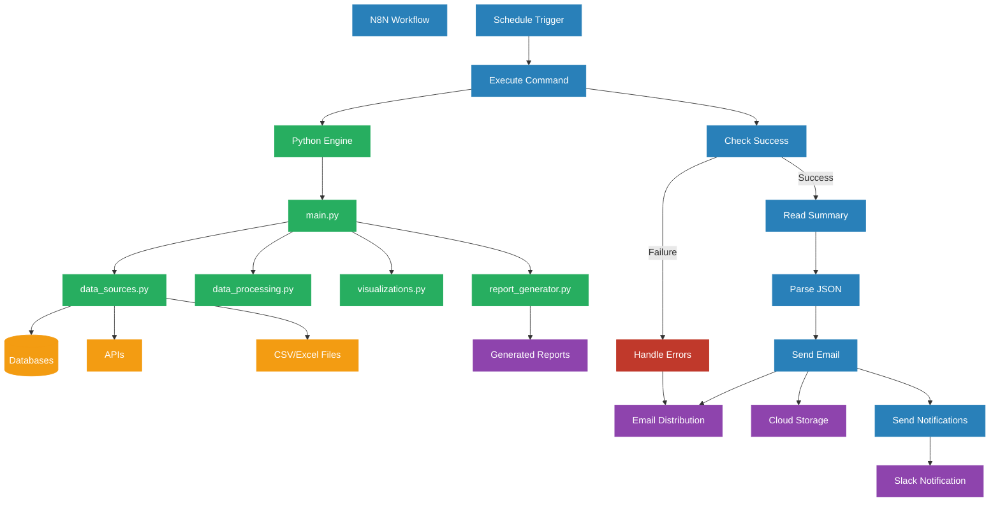

# Automated Financial Reporting System - Flow Diagram

## Data Flow Description

1. **Scheduling & Triggering**:
   - N8N Schedule Trigger initiates the workflow at configured intervals
   - Execute Command node runs the Python script

2. **Data Collection**:
   - Python connects to configured data sources (databases, APIs, files)
   - Raw data is extracted and temporarily stored

3. **Data Processing**:
   - Financial data is cleaned and transformed
   - Analysis is performed based on configuration
   - Metrics are calculated and anomalies detected

4. **Visualization & Report Generation**:
   - Charts and graphs are created based on analysis results
   - PDF reports are generated with data tables and visualizations
   - Excel reports are created with detailed data
   - Interactive dashboards are generated (optional)

5. **Distribution**:
   - N8N reads the report summary JSON
   - Reports are attached to emails and sent to recipients
   - Reports are uploaded to cloud storage (optional)
   - Notifications are sent to Slack or other channels

6. **Error Handling**:
   - Errors are caught and logged
   - Error notifications are sent to administrators
   - The workflow continues with the next scheduled run

## Component Interaction

### Python Components

- **main.py**: Orchestrates the entire reporting process
- **data_sources.py**: Connects to and extracts data from various sources
- **data_processing.py**: Cleans, transforms, and analyzes financial data
- **visualizations.py**: Creates charts, graphs, and interactive visualizations
- **report_generator.py**: Compiles data and visualizations into formatted reports

### N8N Components

- **Schedule Trigger**: Initiates the workflow at specified intervals
- **Execute Command**: Runs the Python script with appropriate parameters
- **Check Success**: Verifies successful execution of the Python script
- **Read Summary**: Reads the report summary JSON file
- **Parse JSON**: Extracts information from the summary
- **Send Email**: Distributes reports to configured recipients
- **Send Notifications**: Alerts stakeholders about report availability
- **Handle Errors**: Manages failures and sends error notifications

This integrated system combines the data processing power of Python with the workflow automation capabilities of N8N to create a robust, enterprise-grade financial reporting solution.