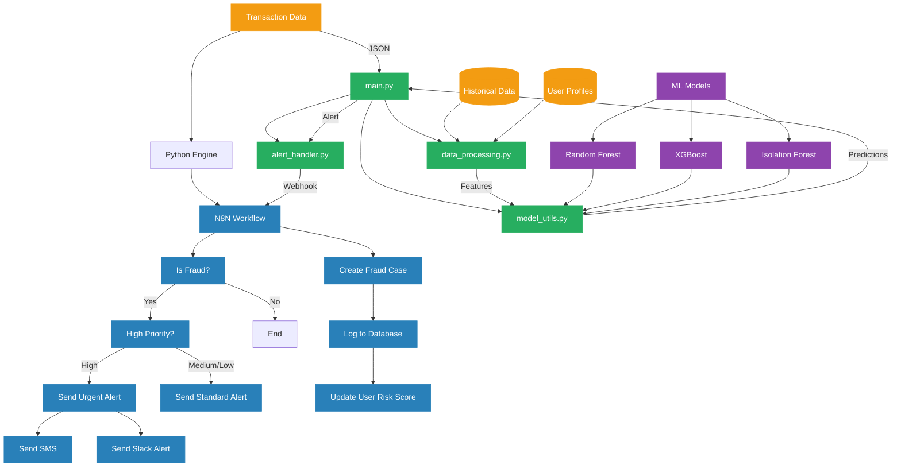

# Fraud Detection Engine - Flow Diagram

## Data Flow Description

The Fraud Detection Engine processes transactions through several stages to detect and respond to potential fraud:

### 1. Transaction Ingestion

- **Transaction Data**: The system receives transaction data in JSON format, either through batch processing or real-time API calls.
- **Data Sources**: The engine can connect to various data sources including databases, message queues, or direct API submissions.

### 2. Feature Engineering

- **Data Processing**: The `data_processing.py` module extracts and transforms raw transaction data into features for the ML models.
- **Historical Context**: User transaction history is retrieved to provide context for the current transaction.
- **User Profiles**: User risk profiles and behavior patterns are incorporated into the feature set.

### 3. Model Scoring

- **Multiple Models**: The transaction is scored by three different models:
  - **Random Forest**: A tree-based ensemble model that excels at capturing complex patterns
  - **XGBoost**: A gradient boosting model that provides high accuracy and feature importance
  - **Isolation Forest**: An anomaly detection model that identifies outliers
- **Model Ensemble**: The `model_utils.py` module combines the scores from all models into a final fraud score.

### 4. Decision Logic

- **Score Evaluation**: The final fraud score is compared against configurable thresholds.
- **Business Rules**: Additional business rules are applied based on transaction amount, user history, and other factors.
- **Confidence Calculation**: A confidence score is calculated to indicate the reliability of the fraud determination.

### 5. Alert Generation

- **Alert Creation**: If fraud is detected, the `alert_handler.py` module creates a detailed alert with all relevant information.
- **Priority Assignment**: Alerts are assigned a priority level (high, medium, low) based on the fraud score, confidence, and transaction amount.
- **Webhook Notification**: The alert is sent to N8N via webhook for further processing.

### 6. Alert Handling (N8N)

- **Priority Routing**: N8N routes the alert based on its priority level.
- **High Priority Alerts**: Trigger immediate notifications via email, SMS, and Slack.
- **Standard Alerts**: Added to the queue for regular review.
- **Case Management**: All alerts are logged in a case management system for tracking and investigation.
- **Risk Updates**: User risk scores are updated based on the fraud detection results.

### 7. Feedback Loop

- **Investigation Results**: Fraud analysts investigate alerts and provide feedback on true/false positives.
- **Model Improvement**: Feedback is used to retrain models and improve detection accuracy.
- **Threshold Adjustment**: Detection thresholds are periodically adjusted based on performance metrics.

## Component Interaction

### Python Components

- **main.py**: Orchestrates the entire fraud detection process
- **data_processing.py**: Handles data extraction, cleaning, and feature engineering
- **model_utils.py**: Manages model loading, prediction, and ensemble logic
- **alert_handler.py**: Creates and distributes fraud alerts

### N8N Components

- **Webhook**: Receives fraud alerts from the Python engine
- **Decision Nodes**: Route alerts based on fraud status and priority
- **Notification Nodes**: Send emails, SMS, and Slack messages
- **API Nodes**: Create cases and update user risk scores
- **Logging Nodes**: Record alerts and actions for audit purposes

This integrated system combines machine learning models with business rules and automated workflows to provide a comprehensive fraud detection and response solution.